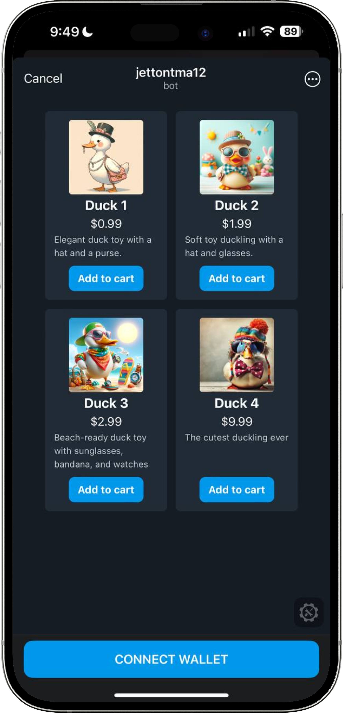
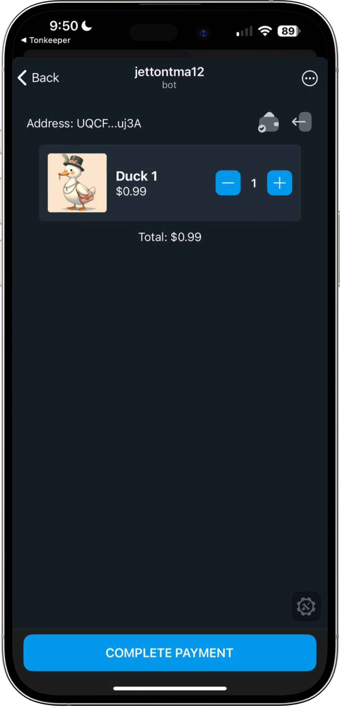
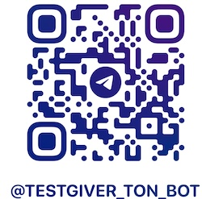
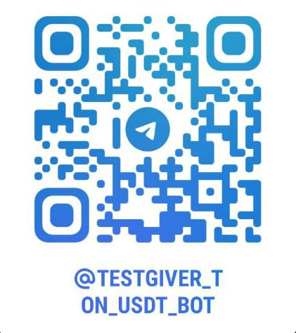

# TMA USD₮ Payments Demo

This Demo TMA showcases the integration with [@tonconnect/ui-react](https://www.npmjs.com/package/@tonconnect/ui-react) and simple processing of USD₮ invoice by [UUID](https://en.wikipedia.org/wiki/Universally_unique_identifier) in comment.

<p align="center">
  
  
</p>

# Give a Try on Testnet

| Action | Link and QR Code                                                        |
| --- |-------------------------------------------------------------------------|
| **Get [TESTNET] Toncoins on your [Testnet TON Wallet](https://docs.ton.org/participate/wallets/apps#tonkeeper-test-environment) via [Test Giver Bot](https://t.me/testgiver_ton_bot).** |                     |
| **Get [TESTNET] USDt on your Testnet TON Wallet via [USDt giver bot](https://t.me/testgiver_ton_usdt_bot). Testnet Toncoin from step (1) required for this step.** |                |
| **Experience [TESTNET] live demo at [tma_jetton_processing_bot](https://t.me/tma_jetton_processing_bot).** |  |

## Prerequisites

### Create Mini App

First of all, to correctly display the application and get the most accurate development experience, you
have to create a Telegram Mini App. After completing this step, you will be able to view the application inside 
Telegram.

Here is the short guide on how to do it:

1. Open [@BotFather](https://t.me/BotFather) in Telegram.
2. Send the `/newbot` command to create a new bot.
3. Follow the prompts to set up your bot, providing all necessary information.
4. After the bot is created, send the `/newapp` command to BotFather.
5. Select your bot from the list.
6. Provide all the required information for your Mini App.

### Install Tunneler

To view the application on other devices, it is required to use any service, allowing you to generate a valid HTTPS
link.

You can use [ngrok]([https://ngrok.com/docs]), [localtunnel](https://localtunnel.github.io/www/), or any other 
known to you.

To install these packages globally, use one of the following commands:

```bash
# Installs ngrok.
yarn install -g ngrok
```

```bash
# Installs localtunnel.
yarn install -g localtunnel
```

### Install Dependencies

To install project dependencies, use the following command:

```bash
yarn install
```

## Running

### Setting Transaction Variables

To configure transaction variables in `src/constants/common-constants.ts`, set the following environment variables:

- `USDT_MASTER_ADDRESS`: The master address of the USDT.
  - **Testnet**,  USDTTT token master: `kQD0GKBM8ZbryVk2aESmzfU6b9b_8era_IkvBSELujFZPsyy`. [Default]
  - **Mainnet**, USD₮ `EQCxE6mUtQJKFnGfaROTKOt1lZbDiiX1kCixRv7Nw2Id_sDs`. You need to set this address manually 
  for production.
- `INVOICE_WALLET_ADDRESS`: The address of the wallet where USDT will be received upon payment.
  > **Important**: This should be the address of the usual TON wallet, not the USDT jetton wallet. 
  > The address of the USDT jetton wallet will be calculated upon sending.

### Starting Application

To start the application, run:

```bash
npm run dev
```

The application will be accessible at [http://localhost:5173](http://localhost:5173).

### Exposing Your Local Server (Optional)

#### Using `ngrok`

```bash
ngrok http 5173
```

#### Using `localtunnel`

```bash
lt --port 5173
```

After setting up ngrok or localtunnel, update your Telegram bot's configuration with the provided URL to ensure the 
bot points to your local development environment.

### Updating Telegram Bot Configuration (Optional)

#### Update the Menu Button URL in Telegram Bot

1. Open [@BotFather](https://t.me/BotFather) in Telegram.
2. Send the `/mybots` command and select your bot.
3. Choose "Bot Settings" then "Menu Button" and finally "Configure menu button".
4. Enter the ngrok or localtunnel URL as the new destination.

#### Update Mini Apps URL in Telegram

1. Open [@BotFather](https://t.me/BotFather) in Telegram.
2. Send the `/myapps` command and select your Mini App.
3. Choose "Edit Web App URL".
4. Enter the ngrok or localtunnel URL as the new destination.

## Learn More About Ton Connect

To understand more about Ton Connect and how it enables blockchain functionalities in your applications, refer to the
following resources:
- [Ton Connect Documentation](https://docs.ton.org/develop/dapps/ton-connect/)
- [Ton Connect SDK and UI Library on GitHub](https://github.com/ton-connect/sdk/tree/main/packages/ui)

## Advanced

### Returning to the Application (Optional)

To return to the application after interacting with the wallet, you must specify a `twaReturnUrl` in `src/App.tsx`.

Here's a concise guide:

- **twaReturnUrl**: This is the return URL used by Telegram Web Apps. Set it to redirect users back to your application after wallet interaction. Example: `'https://t.me/WebAppWalletBot/myapp'`.

Here is a sample configuration for specifying a return URL:

```jsx
<TonConnectUIProvider
    manifestUrl="https://ton-connect.github.io/demo-dapp-with-wallet/tonconnect-manifest.json"
    uiPreferences={{ theme: THEME.DARK }}
    actionsConfiguration={{
        twaReturnUrl: 'https://t.me/WebAppWalletBot/myapp'
    }}
></TonConnectUIProvider>
```

### Adding a Custom Wallet (Optional)

To integrate a custom wallet into your application, adjust the `walletsListConfiguration` in `src/App.tsx`. Include your wallet details in `includeWallets` and specify `universalLink`.

Here's a concise guide:

- **universalLink**: This URL is used to open the wallet directly from a web link. It should link to your wallet's bot or app. Example: `'https://t.me/wallet/start'`.

Here is a sample configuration for adding a custom wallet:

```jsx
<TonConnectUIProvider
  manifestUrl="https://ton-connect.github.io/demo-dapp-with-wallet/tonconnect-manifest.json"
  uiPreferences={{ theme: THEME.DARK }}
  walletsListConfiguration={{
    includeWallets: [
      {
        appName: "telegram-wallet",
        name: "Wallet",
        imageUrl: "https://wallet.tg/images/logo-288.png",
        aboutUrl: "https://wallet.tg/",
        universalLink: "https://t.me/wallet/start",
        bridgeUrl: "https://bridge.tonapi.io/bridge",
        platforms: ["ios", "android", "macos", "windows", "linux"]
      }
    ]
  }} 
  actionsConfiguration={{
    twaReturnUrl: 'https://t.me/WebAppWalletBot/myapp'
  }}
></TonConnectUIProvider>
```

